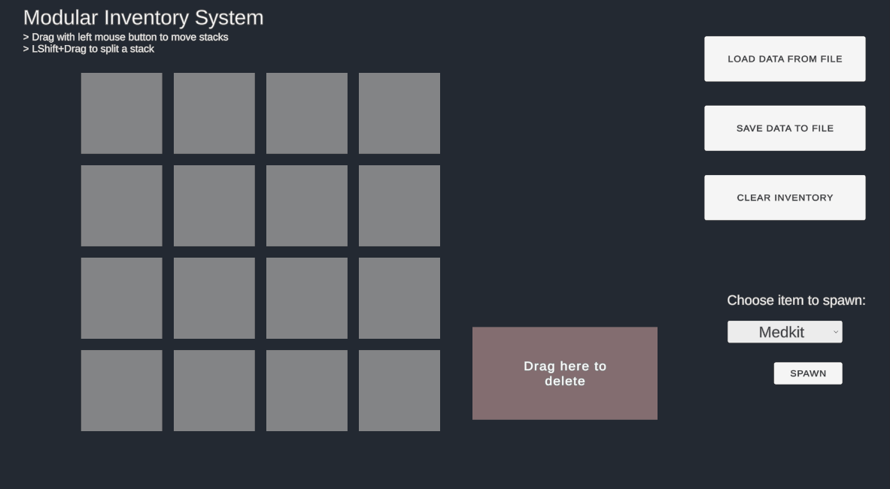

# Modular Inventory Architecture (Unity)

A production-ready, grid-based inventory system demonstrating scalable architecture, efficient memory management, and decoupled design. Built for RPGs, survival games, or data-intensive Unity projects.

**Built With:** Unity 6 (6.000.0.45f1) | C# | New Input System

---

## Visual Overview


*Drag-and-drop with stacking, splitting, and visual feedback*

---

## Architectural Highlights

Designed with adherence to SOLID principles, eliminating tightly-coupled monolithic classes and global singletons.

*   **Pure C# Domain Layer:** Core managers (`InventoryManager`, `SaveLoadManager`) do not inherit from `MonoBehaviour`. Business logic is decoupled from Unity lifecycle and UI components, ensuring testability and safe instantiation.
*   **Manual Dependency Injection:** Dependencies are resolved top-down via a Composition Root (`GameBootstrapper`), eliminating Service Locators and global state. All prefabs and scene objects explicitly declare their dependencies.
*   **Model-View Separation:** UI components (`Slot`, `Tile`) are passive visual representations of internal state. They react to data mutations via C# events (`Action<int>`), eliminating `Update()` polling.
*   **Single Responsibility:** Clear boundary enforcement. Logic is isolated into specific handlers (e.g., `SaveLoadManager` handles file I/O exclusively; `DragManager` handles coordinate resolution and UI parenting).

---

##  Performance & Memory Optimization

*   **O(1) Spatial Lookups:** Replaced expensive LINQ iterations and distance checks with a reactive `Dictionary<Tile, Slot>`. Slots automatically sync their state to this map via property setters, making item location lookups instantaneous with minimal allocation.
*   **Native Object Pooling:** Implements `UnityEngine.Pool.ObjectPool<T>` for dynamic inventory tiles (merging, splitting, spawning). Tiles are recycled and their data wiped rather than destroyed, eliminating GC spikes during heavy inventory manipulation.
*   **Memory Leak Prevention:** Rigorous lifecycle management of event subscriptions. Objects explicitly unsubscribe from data events when returned to the pool, preventing dangling event references.

---

##  Core Gameplay Features

*   **Smart Drag & Drop:** Visual snapping, raycast-blocking management, and automatic fallback routing (items return to their original slot if placement fails or merges partially).
*   **Advanced Stacking Logic:** Supports max-stack limits, partial stack merges with overflow handling, and dynamic stack splitting (Shift + Click) using the New Unity Input System.
*   **Asynchronous Serialization:** Non-blocking JSON save/load architecture utilizing `async/await`. File operations are abstracted behind interfaces (`IJsonFileReader`), allowing seamless future integration with cloud databases without altering game logic.
*   **Fail-Safe Operations:** Placements return specific `PlacementResult` enums (`MergedPartially`, `FailedStackFull`, `FailedDiffItems`) rather than generic booleans, allowing precise UI feedback and error handling.

---

##  Setup & Usage

1. **Clone the repository:**
   ```bash
   git clone https://github.com/yourusername/modular-inventory.git
   ```

2. **Open in Unity 6.000.0.45f1 or later**

3. **Open the demo scene:**  
   `Assets/Scenes/InventoryDemo.unity`

4. **Play and test:**  
   - Drag items between slots  
   - Hold Shift + Click to split stacks  
   - Save/Load via UI buttons

---

##   Project Structure

```
Assets/
├── Scripts/
│   ├── Core/               # Pure C# domain logic (InventoryManager, Item)
│   ├── UI/                 # View components (Slot, Tile, DragManager)
│   ├── Persistence/        # Save/Load (SaveLoadManager, IJsonFileReader)
│   └── Bootstrap/          # Composition root (GameBootstrapper)
├── Prefabs/                # Inventory UI, item tiles
└── Scenes/                 # Demo scene
```

---

##   Key Technical Learnings

- **Dependency Injection without frameworks:** Implemented manual DI via constructor injection, proving understanding of the pattern without relying on third-party libraries (Zenject, VContainer).
- **Async patterns in Unity:** Learned to safely bridge `async/await` with Unity's main thread constraints using `UniTask`-compatible patterns.
- **Data-driven UI:** Transitioned from imperative UI updates to reactive, event-driven patterns—reducing coupling and improving maintainability.

---

##   License

MIT License - Free for personal and commercial use.

---

##   Contact

**Marcin Myszkiewicz**  
LinkedIn: [linkedin.com/in/marcinmgames/)](https://www.linkedin.com/in/marcinmgames/)  
Email: marcin.cz758@gmail.com

---